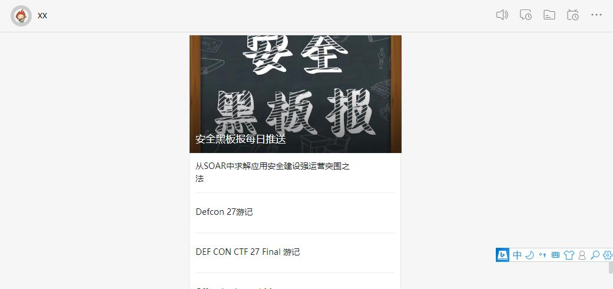

# Drobots v1.0 #

环境为Python2.7，脚本用于关联钉钉机器人并推送安全新闻。

* [2019-08-16] 
  * 增加sec-wiki、wiki-inio、52bug

## 安装 ##
> pip install -r requierments

## 启动 ##

pytho Drobots.py

## 添加计划任务 每天下午7点推送一次 ##

0 19 * * * /usr/bin/python /root/Drobots.py

## Screenshot ##

## 致谢 ##

* https://www.sec-wiki.com
* http://wiki.ioin.in/
* http://www.52bug.cn/

## 安全黑板报微信群 ##

